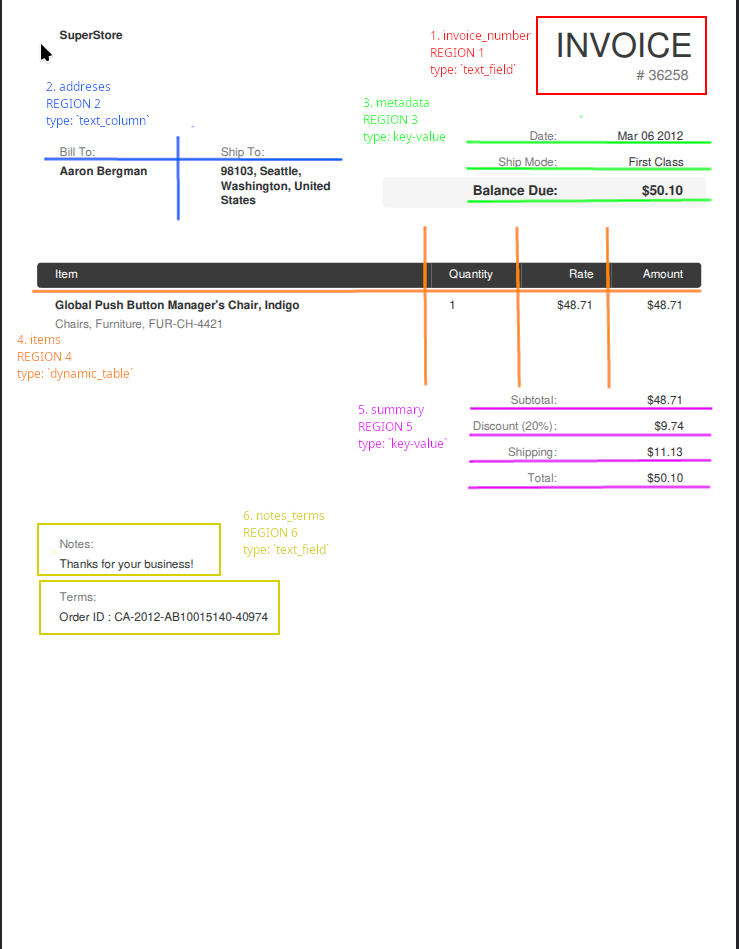

# Invoice data extraction notes

Example of data extraction from pdf to Excel or CSV format.

The target spreadsheet files are `invoices` and `line_items`

## Example record `invoices`

| invoice_number | bill_to | ship_to | invoice_date | ship_mode | balance_due | subtotal | discount | shipping | total | notes | order_id | source_file |
| --- | --- | --- | --- | --- | --- | --- | --- | --- | --- | --- | --- | --- |
| 42692 | Ann Chong | Nairobi, Nairobi, Kenya | Sep 30 2012 | Standard Class | 4159.60 | 4066.56 | - | 93.04 | 4159.60 |  | KE-2012-AC61569-41182 | invoice_001.pdf |

## Example record `line_items`

| invoice_number | row_no | item | quantity | rate | amount | source_file |
| --- | --- | --- | --- | --- | --- | --- |
| 42692 | 1 | SanDisk Router, Ergonomic | 4 | 1016.64 | 4066.56 | invoice_001.pdf |

## Invoice format

Invoices in this project follow a common layout divided into extraction regions.

1. `invoice_nr` - a single-field region containing the invoice number. I use `pdfplumber` here instead of a regex because the parser is based on explicit document regions, and this keep the extraction logic consistent with the rest of the codebase.
2. `addresses` - a two-column text region containing billing and shipping addresses.
3. `meta` - a key-value region containing invoice metadata.
4. `items` - a dynamic table region containing line items.
5. `summary` - a key-value region containing totals and charges.
6. `notes_terms` - a text-field region containing notes, terms, or order references.

## Why region-based extraction ?

This approach allows me to choose different strategies by splitting document into smaller fragemtns called regions. Almost all of regions contains another type of data, for example `summary` contains data that looks like `key-value` pattern, but `items` reflect table shape. Parser have to handel all of these types, that's why regions are apropriate approach.

## `line_items` table

To parse line_items I use also regions, but with one difference. I choose to mark bottom-boundaries dynamicly.